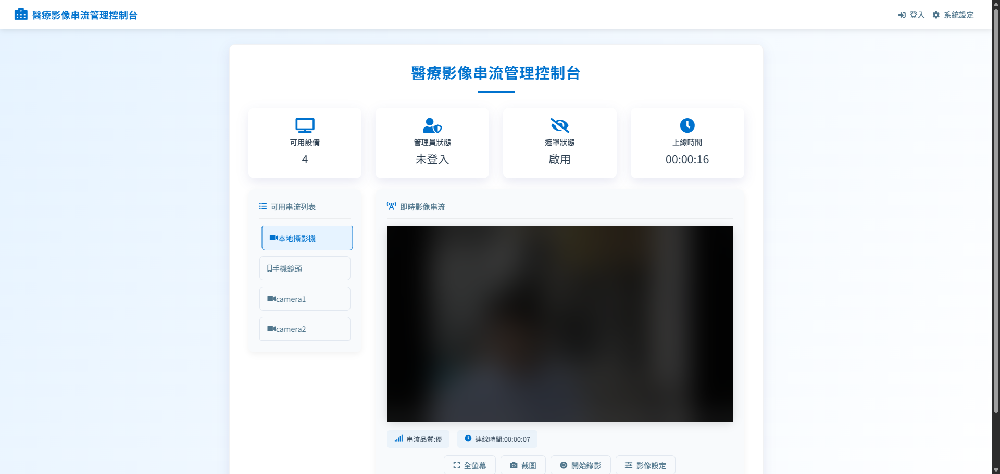

# SecureMedStream

SecureMedStream 是一個基於 Pion 的 **RTSP 轉 WebRTC** 醫療影像串流平台，提供即時串流功能，並具備 **隱私保護** 與 **權限管理** 特性。

---

## 🚀 主要功能

- **RTSP 轉 WebRTC**：支援即時影像串流。
- **隱私保護**：提供影像遮罩與模糊處理，確保病患隱私。
- **多設備支援**：兼容本地攝影機、手機鏡頭及其他 RTSP 來源。
- **權限管理**：管理員可登入帳號密碼觀看未經遮罩的影像。
- **影像錄製與截圖**：內建錄影與快照擷取功能。
- **設備監控**：顯示可用設備與系統狀態。

---

## 📸 介面預覽



---

## 🛠 安裝與使用

### 1️⃣ **環境需求**
- Python 3.8+
- Node.js 16+
- FFmpeg
- WebRTC 相關依賴

### 2️⃣ **克隆專案**
```bash
git clone https://github.com/XiaoZe930705/SecureMedStream.git
cd SecureMedStream
```

### 3️⃣ **安裝依賴**
```bash
pip install -r requirements.txt  # 安裝 Python 依賴
npm install  # 安裝前端依賴
```

### 4️⃣ **設定環境變數**
請修改 `.env` 檔案如下：
```
RTSP_URL=rtsp://your_camera_url
SECRET_KEY=your_secret_key
```

### 5️⃣ **啟動後端**
```bash
python app.py
```

### 6️⃣ **啟動前端**
```bash
npm run dev
```

---

## 🔐 權限管理

- **一般使用者**：僅可觀看經過遮罩處理的影像。
- **管理員**：需登入帳號密碼，才能觀看未經遮罩保護的影像。

管理員可透過管理介面調整隱私保護與設備權限。

---

## 🔄 配置設定

### 修改 `config.json`
範例設定：
```json
{
  "server": {
    "http_port": ":8083"
  },
  "streams": {
    "camera1": {
      "on_demand": false,
      "url": "rtsp://your_camera_url"
    },
    "camera2": {
      "on_demand": true,
      "url": "rtsp://another_camera_url"
    }
  }
}
```

為了避免影像卡頓與效能問題，請將 `"on_demand": false` 設定為持續串流模式。

---

## 📄 授權
本專案採用 MIT 授權，詳見 `LICENSE` 文件。

---

## 💡 未來改進方向
- [ ] 優化 WebRTC 低延遲技術。
- [ ] 增加更多影像處理功能（去識別化、邊緣偵測等）。
- [ ] 提供 Docker 部署選項。

📢 如果有任何建議或貢獻，歡迎提交 Issue 或 PR！

